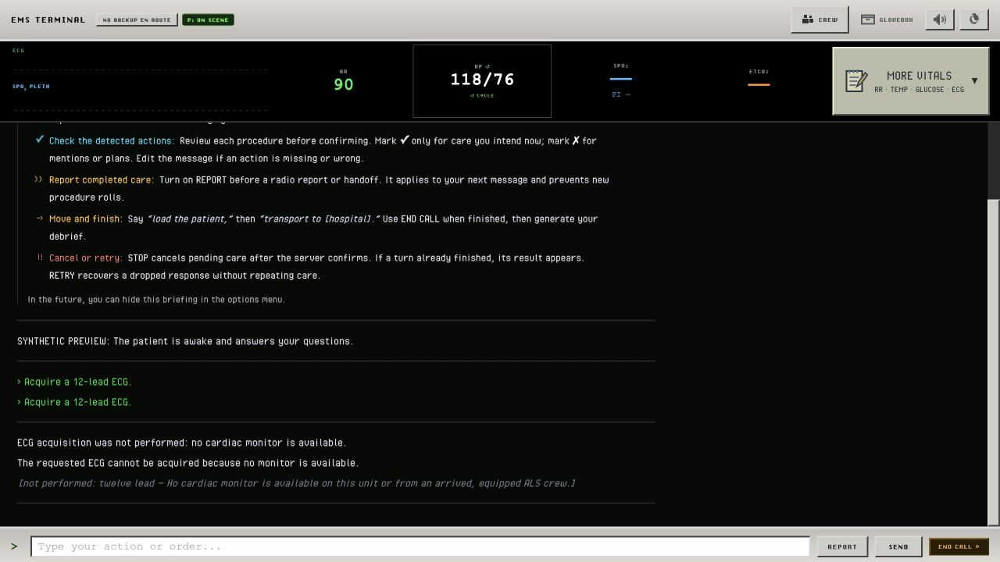

# Gameplay gap verification — October 9, 2026

The five issues from the October 8 prompt review were addressed locally.

| Issue | Change and verification |
| --- | --- |
| BLS acquisition without a monitor | ECG procedures are blocked before dice and printout creation. Confirmation explains the restriction and disables execution. Arrived ALS backup must explicitly have an available monitor. Verified blocked and eligible states in the side browser. |
| Arrival reset the hospital destination | Skips retain the committed destination and ETA, including absent or contradictory response tags. The side preview retained major hospital and 25-minute ETA after arrival. Normal explicit redirection remains supported. |
| Report turns ignored time | Valid advancing TIME footers now apply to reports and handoffs without procedure rolls. Missing or regressing report timestamps hold the last known clock. Side preview advanced 7 to 7.5 minutes. |
| ECG filter damaged dialogue | Questions, requests and patient history survive filtering; unsupported narrated ECG interpretations remain filtered. The complete nurse question and balanced quotes appeared in the report preview. |
| Debrief invented downstream certainty | The prompt and evidence context separate recorded handoff from hypothetical hospital events. A narrow guard requests one rewrite for detected downstream guarantees, then fails without returning feedback if those guarantees persist. Both model requests share the existing time budget. |

The confirmation editor also supports correcting or adding missed orders and rechecking before execution. Direct IV attempt/retry wording is recognized; negated, conditional and historical mentions remain protected. The side preview exercised rechecking an IV-plus-ECG order, confirming each action once, and the ECG printout transition. The editor was checked at desktop size and 390 × 844; the viewport override was reset afterward.

## Validation

- `npm test`: roller and randomness checks passed; 235 Node tests passed, with no failures or skips.
- `git diff --check`: clean.
- `node test/preview-gameplay-gaps.js`: production UI, routes and Session with synthetic gameplay in temporary storage. Preview tabs remain open at `http://127.0.0.1:3131/` and `/qa`. The interactive fixture is not a clinical scenario evaluation.
- Three explicitly triggered live debrief samples used synthetic shock-care evidence. `initial-debrief.json` and `prompt-only-debrief.json` retain the observed overclaims before the guard. `guarded-debrief.json` contains the final sample, which stayed within recorded care and possible benefits. Unit tests force repair success and repair rejection independently of model sampling.

The evidence guard detects specific guarantee wording; it is not a complete clinical factuality validator. These checks do not establish that every future model response will be accurate. Debriefs retain their existing experimental status.

